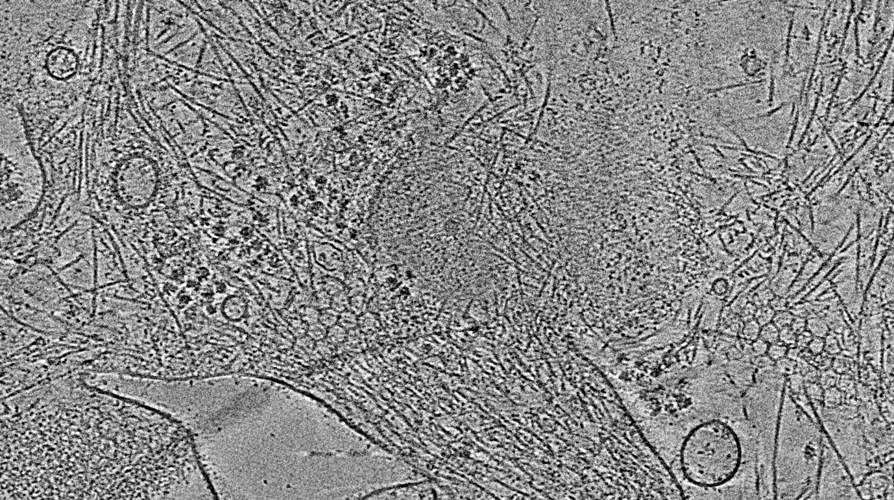

# Development notes

For now, add a new file and command for each new function. Later, this can be cleaned up.
 
# STA Pipeline

Scripts and procedures for a subtomogram averaging (STA) pipeline used in the CZI-funded project "Correlative cryo-electron tomography pipeline of plasma membrane complexes."

(placeholder image)

## Installation (Linux-based system)

Open a command-line terminal in the folder you wish to create a directory containing this package. Run the code below to clone the repository. 

`git clone https://git.lobos.nih.gov/dmichalak/sta_pipeline.git`

After moving into the cloned directory with ``cd sta_pipeline``, create a new Python environment for using the pipeline and install the package with ``pip``.

`pip install -e .`

After running this, the scripts referenced in ``setup.py`` will be callable from the command-line (**incomplete**).
## Directory structure

data/
    batch001/
        frames/
        mdoc/

``frames/`` contains all tilt movies in the data batch.
``mdoc/`` contains all of the mdoc files for each tilt series dataset.

After running ``sta_alignframes``, the structure within ``data/batch001`` will be
    frames/
    mdoc/
    ts001/
    ts002/
    ...

where ``ts###`` will refer to each tilt series found in ``mdoc/``.

## Example commands
All commands should have help text available by calling the function with ``--help``.
``sta_alignframes --batchdir ./ --framesdir ./frames/ -ab 8 -sb 8``
``sta_batchruntomo -d ./directives.adoc -b . -n 48 -s 0 -e 8 -bin 8``
``sta_fidder -i ts001/test_ts001_bin8_ali.mrc -o ts001/ -p 8.66``
## Software requirements*

- ``Python 3+``
- [``IMOD``](https://bio3d.colorado.edu/imod/)
- [``fidder``](https://github.com/teamtomo/fidder)
- [``IsoNet``](https://github.com/IsoNet-cryoET/IsoNet)
- [``EMAN2``](https://blake.bcm.edu/emanwiki/EMAN2)
- [``Dynamo``](https://wiki.dynamo.biozentrum.unibas.ch/w/index.php/Main_Page)
- [``RELION``](https://relion.readthedocs.io/en/release-4.0/)

*Scripts and the above software have only been tested on a Linux-based system so far

## I. Preprocessing

Software: ``IMOD``, ``fidder``

- Align and sum tilt movies to generate a tilt stack.
- Fiducial-based tilt series alignment
- CTF correction
- Mask and erase fiducials prior to reconstruction
- Reconstruct tomograms with R-weighting

## II. Particle picking

Software: ``IsoNet``, ``EMAN2``, ``Dynamo``, ``RELION`` 

- Prepare tomograms for particle picking via denoising and modeling the missing wedge
- Train a neural network to automatically locate densities of interest in tomograms
- Sample subtomogram positions from the trained model predictions
- Clean the subtomogram dataset by removing duplicates, alignment, classification, etc.

## III. Refinement

Software: ``RELION``

- Extract subtomograms using the cleaned dataset
- Iteratively
    - Refine alignments
    - Classify
    - Refine CTF parameters
    - Refine tilt series alignments
- Postprocessing

***
<!---
Within a particular ecosystem, there may be a common way of installing things, such as using Yarn, NuGet, or Homebrew. However, consider the possibility that whoever is reading your README is a novice and would like more guidance. Listing specific steps helps remove ambiguity and gets people to using your project as quickly as possible. If it only runs in a specific context like a particular programming language version or operating system or has dependencies that have to be installed manually, also add a Requirements subsection.

## Usage
Use examples liberally, and show the expected output if you can. It's helpful to have inline the smallest example of usage that you can demonstrate, while providing links to more sophisticated examples if they are too long to reasonably include in the README.

## Support
Tell people where they can go to for help. It can be any combination of an issue tracker, a chat room, an email address, etc.

## Roadmap
If you have ideas for releases in the future, it is a good idea to list them in the README.

## Contributing
State if you are open to contributions and what your requirements are for accepting them.

For people who want to make changes to your project, it's helpful to have some documentation on how to get started. Perhaps there is a script that they should run or some environment variables that they need to set. Make these steps explicit. These instructions could also be useful to your future self.

You can also document commands to lint the code or run tests. These steps help to ensure high code quality and reduce the likelihood that the changes inadvertently break something. Having instructions for running tests is especially helpful if it requires external setup, such as starting a Selenium server for testing in a browser.

## Authors and acknowledgment
Show your appreciation to those who have contributed to the project.

## License
For open source projects, say how it is licensed.
